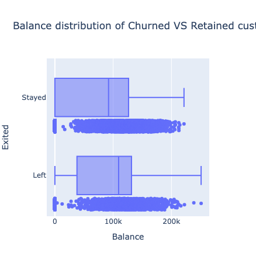
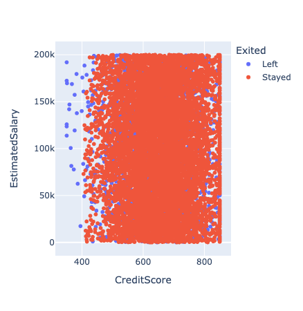
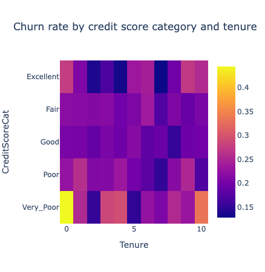

# Churn data exploration for a bank

## Overview

This project is focused on exploring a dataset of the bank customers to see data patterns and get a better understanding of hidden dependencies behind loyal and churning customers.

The conclusions help with preparing
a better dataset for ML problems like **predicting churn** as well as **provide the bank with better business intelligence on the churn problem**.

## [Bank customers dataset](https://lms-cdn.skillfactory.ru/assets/courseware/v1/c903ecd0b0c995c44213d620ab6ae94d/asset-v1:SkillFactory+DST-3.0+28FEB2021+type@asset+block/churn.zip)

- `RowNumber` - number of the table row
- `CustomerId` - customer ID within the bank's systme
- `Surname` - customer's surname
- `CreditScore` - customer's credit score (the higher it is, the more credits the customer paid for)
- `Geography` - customer's country
- `Gender` - customer's gender
- `Age` - customer's age
- `Tenure` - how many years the customer's been with the bank
- `Balance` - customer's balance across all accounts within the bank
- `NumOfProducts` - number of products the customer purchased from the bank
- `HasCrCard` - whether the customer has a credit card (1 - yes, 0 - no)
- `IsActiveMember` - whether the customer is active (1 - yes, 0 - no)
- `EstimatedSalary` - estimated annual salary of the customer in EUR
- `Exited` - whether the customer left the bank (1 - churned, 0 - stayed)

## Data visualization examples

### Balance distribution of Churned VS Retained customers

- Median balance of reteained customers (€92K) is less than the one for churned customers (€109)
- Quantile 1 of retained customers is €0 while Qualtile 1 of churned customers is €37K

These observations signal a significantly higher net worth of churned customers compared to the retained ones. Potential reasons can include:

1. Poor premium service provided by the bank, assumign the higher the customer balance, the more likely they are to require premium service;
2. Low perceived value or shortage of financial products provided by the bank to the customers with higher balances. The assumption is that those customers don't want to lose money due to inflation and leave to competitor banks which offer higher perceived value, whether it is a better service, higher returns or something else.

### Churned VS Retained by estimated salary and credit score

There is no apparent relationship between credit score, estimated salary and the probability of the customer to churn, except one: customers with the credit score below 400 and the estimated salary above €50K stay with the bank.

However, this might be due to low probability for them to get a credit in another bank, and so they don't see urgency in leaving.

### Churn rate by credit score and tenure

Top-5 churning categories:

1. Very poor credit score / 0-year tenure (44.44% churned)
2. Very poor credit score / 10-year tenure (33.33%)
3. Very poor credit score / 4-year tenure (29.31%)
4. Very poor credit score / 3-year tenure (28.57%)
5. Excellent credit score / 0-year tenure (27.50%)

Given the very poor credit score is 300-500 and the excellent credit score is 781-851, we can draw the following conclusions and recommendations:

- Since earlier we saw that the customers with the credit score below 400 were almost all staying, we can assume that the most of the churn in the segment is the customers with the credit score 400-500 which is also backed by the previous figure. The assumption here is that those kind of customers try to get a credit and increase their credit score further, but since the bank doesn't give them this opportunity, they leave for other banks and financial insitituions
- The bank should research into why excellent customers, who recently joined the bank, are leaving. This reiterates one of the previous conclusions that the bank might have either poor premium services or unatttractive financial products for high-end customer segments.

## Further work

- Dig into the current bank products and credit policies to validate assumptions made by analysing the dataset
- Develop product hypotheses related to how the target customer segments can be retained better and devise the plan for testing those
- Test product hypotheses to improve retention of target customer segments, measure their results and iterate accordingly

## Tech stack

### Language & version

- [Python 3.8.10](https://www.python.org/downloads/release/python-3810/)

### Data analysis

- [Pandas 2.0.3](https://pandas.pydata.org/)

### Data visualization

- [Plotly 5.18.0](https://plotly.com/)
